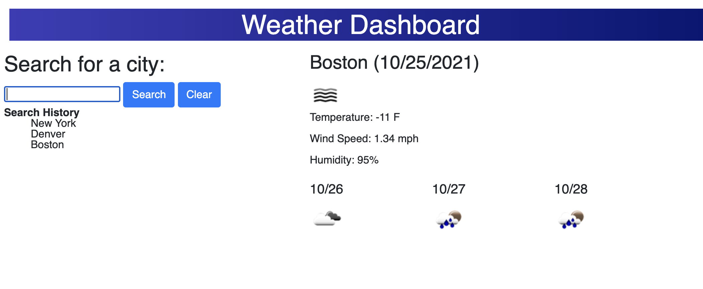

# <Weather Dashboard>

## Description

This project is planner that updates the date according to the current time. It also highlights the hour blocks that have passed, are current, and are in the future in different colors.

## Installation

Open the script.js, style.css and index.html files in VS Code.

## Usage

Type your event in the form for each hour block. You can see the current date in the header and what the next event is based on the highlighted time.

[a link] https://mwathomas.github.io/weather-dashboard/

Next steps to be built out could be different days on different pages.

## Credits

No collaborators on this project
